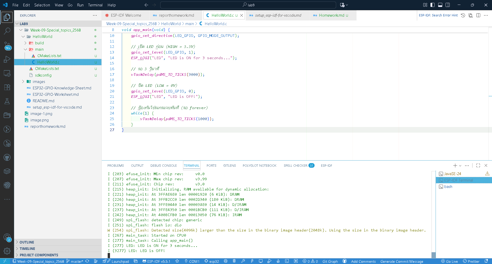
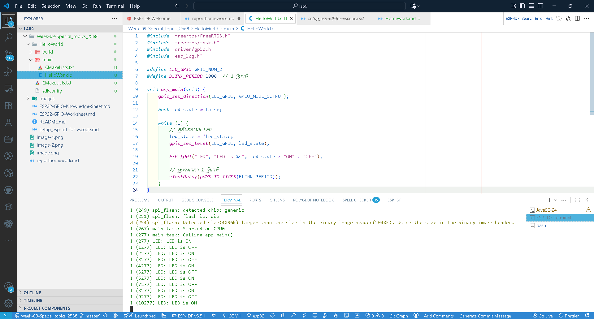
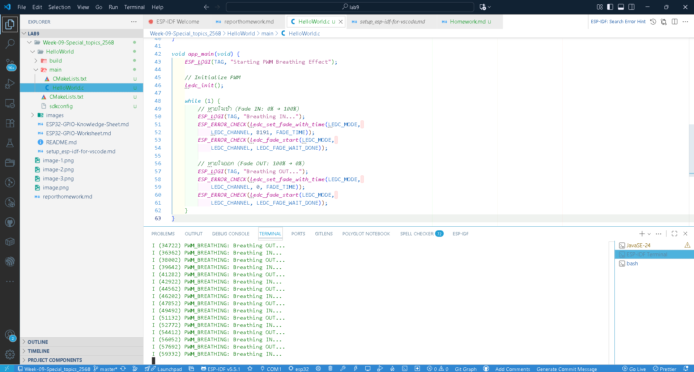
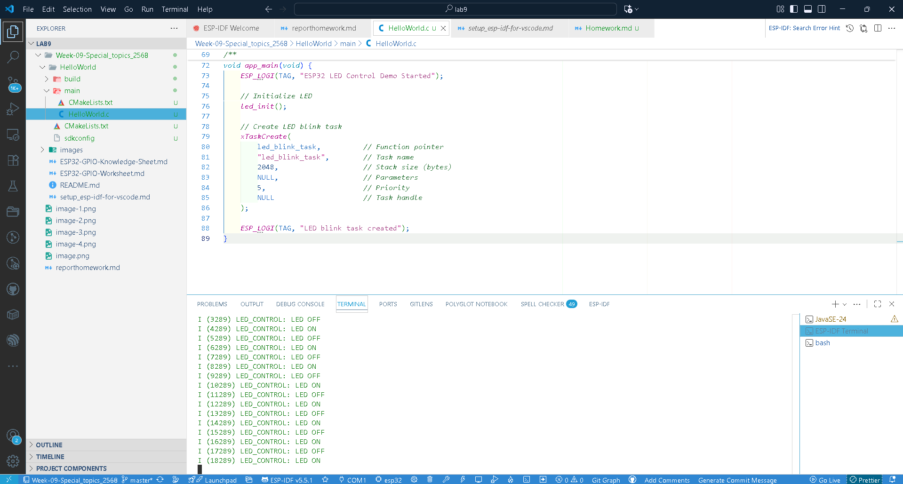
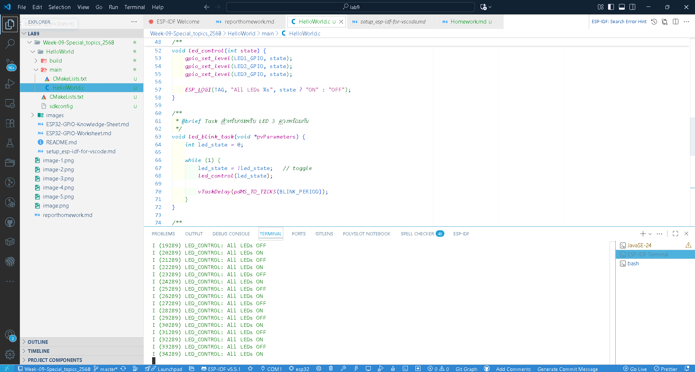
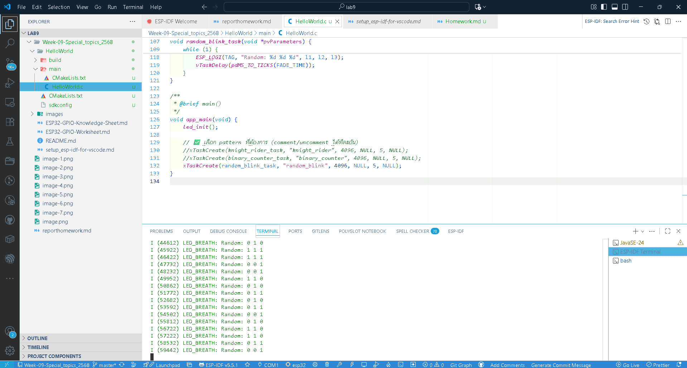

LAB1  Lab 1: LED Basic Control (Step by Step) //
Step 1: LED ON - โปรแกรมพื้นฐานที่สุด

Step 2: LED OFF - เข้าใจการปิด LED

Step 3: LED Blink - การควบคุมแบบวนลูป

Lab 2: PWM Breathing Effect//
Step 4: PWM Breathing Implementation

Complete Implementation Example

Advanced Exercises
Exercise 1: Multiple LEDs

Exercise 2: LED Patterns

Exercise 3: LED Patterns ท้าทายอีกขั้น
